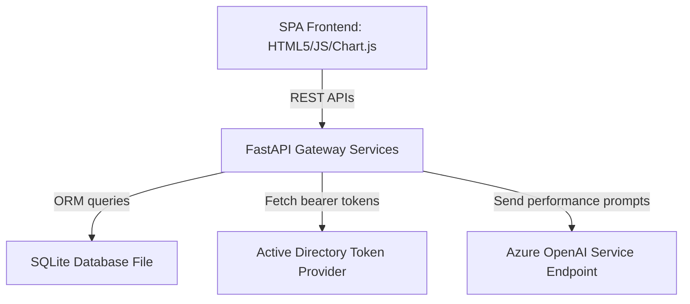

# Architecture Documentation - TalentIQ

TalentIQ is designed with a decoupled, three-tier architecture separating presentation, core orchestration logic, and enterprise analytics services.

---

## 🏗️ Architectural Overview

### 1. Presentation Tier (SPA Frontend)
* **Structure**: Static HTML5 + Vanilla CSS layout implementing a Microsoft Azure-inspired corporate panel.
* **Orchestration (`app.js`)**: Dynamic view routing, grid filtering, sorting, CSV/Excel/PDF document downloads, and lazy loaded `Chart.js` rendering contexts.

### 2. Application Tier (FastAPI Gateway)
* **PerformanceDataService**: Aggregates raw exam scores, milestone completions, quiz results, and attendance records into unified cohort JSON structures.
* **PromptBuilder**: Standardizes performance data schemas into structured Markdown summaries. No raw database rows are sent to the LLM to comply with data privacy policies.
* **AzureOpenAIService**: Authenticates requests using `DefaultAzureCredential()` in development and `ManagedIdentityCredential()` in production. Utilizes token provider APIs (`get_bearer_token_provider`) to call deployment endpoints.
* **AIResponseParser**: Cleanses and parses raw markdown strings returned from the model into strict JSON schema templates.

### 3. Data Tier (SQLite Database)
* Encapsulates entities for Bootcamps, Trainees, Weekly Tests, Assignments, Module Tests, Simulation Projects, Certifications, and Attendance records.

---

## 🔒 Security Design

* **Zero API Key Policy**: The application does not store or utilize OpenAI API keys. All credentials utilize Azure AD RBAC access.
* **Data Sanitization**: Excludes personal identifiable information (PII) during LLM prompting.
* **Trace Warnings Mode**: Toggled via `AI_MODE` configuration:
  * `developer`: Exposes token exception trace outputs on the client dashboard.
  * `demo` / `production`: Suppresses error traces on the client side while logging the traceback on backend logs.
