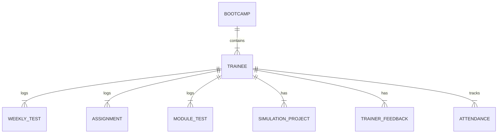

# Database Schema Documentation

TalentIQ uses a relational SQLite database structure to track bootcamps, performance metrics, and trainee milestones.

---

## 📊 Entity Relationship Diagram

---

## 📁 Tables Reference

### 1. `bootcamps`
Stores information about curriculum programs.
* `bootcamp_id` (Primary Key): Integer
* `name`: Text
* `start_date`: Text (YYYY-MM-DD)
* `end_date`: Text (YYYY-MM-DD)
* `status`: Text ("Active", "Completed")
* `description`: Text

### 2. `trainees`
Stores information about enrolled individuals.
* `trainee_id` (Primary Key): Integer
* `employee_id`: Text (Unique)
* `name`: Text
* `email`: Text (Unique)
* `phone`: Text
* `college`: Text
* `degree`: Text
* `joining_date`: Text
* `status`: Text ("Active", "On Bench", "Placed")
* `is_project_ready`: Integer (0 or 1)
* `needs_mentoring`: Integer (0 or 1)
* `score`: Float (Overall readiness percentage)
* `bootcamp_id` (Foreign Key): Integer

### 3. `weekly_tests`
Stores weekly quiz records.
* `test_id` (Primary Key): Integer
* `week_number`: Integer
* `module_name`: Text
* `quiz_name`: Text
* `obtained_marks`: Float
* `max_marks`: Float
* `status`: Text ("Graded", "Pending")
* `remarks`: Text
* `trainee_id` (Foreign Key): Integer

### 4. `assignments`
Stores assignment metrics.
* `assignment_id` (Primary Key): Integer
* `assignment_name`: Text
* `module_name`: Text
* `obtained_marks`: Float
* `max_marks`: Float
* `status`: Text ("Graded", "Submitted")
* `remarks`: Text
* `trainee_id` (Foreign Key): Integer

### 5. `module_tests`
Stores core module exam ratings.
* `module_test_id` (Primary Key): Integer
* `module_name`: Text
* `obtained_marks`: Float
* `max_marks`: Float
* `status`: Text ("Graded", "Pending")
* `trainee_id` (Foreign Key): Integer

### 6. `simulation_projects`
Stores final simulation project evaluations.
* `project_id` (Primary Key): Integer
* `project_title`: Text
* `project_description`: Text
* `submission_date`: Text
* `obtained_marks`: Float (Code score)
* `presentation_score`: Float
* `communication_score`: Float
* `documentation_score`: Float
* `innovation_score`: Float
* `overall_score`: Float
* `technical_evaluation`: Text
* `trainer_remarks`: Text
* `status`: Text ("Completed", "In Progress", "Not Started")
* `trainee_id` (Foreign Key): Integer (Unique)

### 7. `trainer_feedbacks`
Stores structured skills matrix evaluations.
* `feedback_id` (Primary Key): Integer
* `module_name`: Text
* `tech_knowledge`: Integer (1-5)
* `problem_solving`: Integer (1-5)
* `code_quality`: Integer (1-5)
* `teamwork`: Integer (1-5)
* `learning_attitude`: Integer (1-5)
* `strengths`: Text
* `areas_for_improvement`: Text
* `overall_comments`: Text
* `trainer_name`: Text
* `trainee_id` (Foreign Key): Integer

### 8. `attendances`
Tracks daily attendance logs.
* `attendance_id` (Primary Key): Integer
* `date`: Text (YYYY-MM-DD)
* `status`: Text ("Present", "Absent", "Leave")
* `trainee_id` (Foreign Key): Integer
